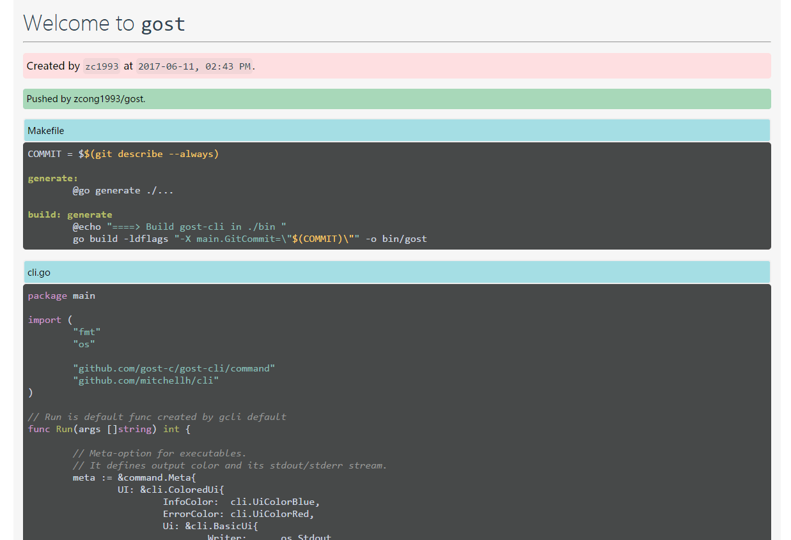

# gost

> 一个类似`gist`的服务

## 是什么

`gost`是一个类似于[gist](https://gist.github.com/)的服务。并且它有自己的命令行客户端工具[gost-cli](https://github.com/gost-c/gost-cli)。

由于核心后端和cli都是由`go语言`写的， 所以取名`gost`。

核心包括：
  - [gost](https://github.com/gost-c/gost) `gost`核心后端程序
  - [gost-cli](https://github.com/gost-c/gost-cli) `gost`命令行工具
  - [gost-web](https://github.com/gost-c/gost-web) `gost`前端网页显示服务

有了这些，我们可以快速分享自己的一些程序源码文件进行讨论。

而且，[gost](https://github.com/gost-c) 所有项目均开源，你可以开发、部署为自己的服务。

查看[安装](install)快速使用。

## 为什么

不是已经有`gist`吗？

确实存在，而且gist服务非常完美，支持版本控制，私有公有项目，并且还可以快速嵌入在任何网页，但是：

- 在国内网络环境下局限很大 （GFW, 我们很难保证对方可以翻墙）
- 没有官方命令行工具 （需要`gist`命令行工具的可以查看本人的项目[gist](https://github.com/zcong1993/gist)）

## 使用场景

编程遇到问题远程寻求帮助时，使用聊天工具粘贴代码（聊天工具转义字符，而且没有高亮，格式混乱），截图（有滚动条难以得到完整截图， 接收者无法复制粘贴快速在本地重现问题）均不方便。国内又因为伟大的防火墙访问不了[gist](https://gist.github.com/)，而且`gist`无自带客户端。

这时，我们的 `gost` 就可以登场了。

假如我们分享本地文件`main.go`, `cli.go`, `Makefile`，只需
```bash
$ gost push main.go cli.go Makefile
# 成功后将得到url链接： http://gost.surge.sh/#/7f6fbcc7-8a8b-443e-a88e-39f49c693215
```
将得到的[链接](http://gost.surge.sh/#/7f6fbcc7-8a8b-443e-a88e-39f49c693215)发送给别人，就ok了。



链接是由我们的`gost-web`提供的展示以及代码highlight服务。

## License

MIT &copy; zcong1993
